# KUMPA CHAT - Documentation Technique

> **Version :** 3.0.0
> **Date :** 29 Janvier 2026
> **Projet :** Kumpa Chat — Plateforme nationale d'échanges sécurisés
> **Organisation :** République du Sénégal — Niane Technologies

---

## Table des matières

1. [Présentation du projet](#1-présentation-du-projet)
2. [Architecture globale](#2-architecture-globale)
3. [Services et communication](#3-services-et-communication)
4. [Authentification (Keycloak → MAS → Synapse)](#4-authentification)
5. [Chiffrement et sécurité des données](#5-chiffrement-et-sécurité-des-données)
6. [Application iOS — Kumpa Chat](#6-application-ios)
7. [Notifications Push](#7-notifications-push)
8. [Appels Audio/Vidéo](#8-appels-audiovidéo)
9. [Ports réseau et firewall](#9-ports-réseau-et-firewall)
10. [Environnements](#10-environnements)
11. [Reverse Proxy Nginx](#11-reverse-proxy-nginx)
12. [Fichiers critiques et sauvegarde](#12-fichiers-critiques-et-sauvegarde)
13. [Références](#13-références)

---

## 1. Présentation du projet

### 1.1 Vision

Kumpa Chat est la **plateforme nationale de messagerie sécurisée du Sénégal**, conçue pour les échanges officiels du gouvernement. Elle repose sur le **protocole Matrix**, un standard ouvert de communication décentralisée offrant le chiffrement de bout en bout (E2EE).

### 1.2 Objectifs

- **Souveraineté numérique** — Hébergement national des données
- **Sécurité** — Chiffrement E2EE, authentification centralisée via Keycloak
- **Interopérabilité** — Protocole Matrix ouvert, fédération possible
- **Appels intégrés** — Audio/vidéo via LiveKit (WebRTC)
- **Multi-plateforme** — iOS, Android, Web

### 1.3 Composants principaux

| Composant | Technologie | Version | Rôle |
|-----------|-------------|---------|------|
| Homeserver | Synapse | v1.134.0 | Serveur Matrix (messages, salons, fédération) |
| Authentification | MAS | main (latest) | Fournisseur OIDC pour Synapse |
| Identity Provider | Keycloak | staging | Gestion des identités et comptes |
| Appels SFU | LiveKit | latest | Routage WebRTC audio/vidéo |
| Appels UI | Element Call | latest | Interface d'appel web/widget |
| Appels JWT | LiveKit JWT Service | latest | Génération de tokens d'accès |
| Push | Sygnal | v0.16.0 | Passerelle APNs (iOS) et Firebase (Android) |
| Client iOS | Element X iOS (fork) | Swift 5.0 / iOS 17.6 | Application mobile native |
| Base de données | PostgreSQL | 15 (externe) | Stockage des données |
| Administration | Synapse Admin | latest | Interface web d'administration |

---

## 2. Architecture globale

### 2.1 Vue d'ensemble

L'infrastructure est composée de 8 services Docker qui communiquent entre eux via un réseau Docker interne en HTTP. L'accès externe passe par un reverse proxy Nginx qui gère le TLS.

**Clients → Nginx (TLS) → Services Docker (HTTP) → PostgreSQL (externe)**

### 2.2 Diagramme d'architecture

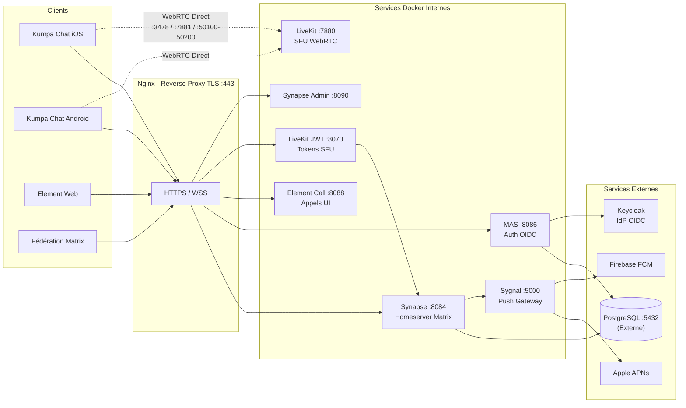

Les clients (iOS, Android, Web) se connectent aux services via Nginx sur le port 443. Les appels WebRTC passent directement par LiveKit sur les ports dédiés (3478, 7881, 50100-50200).

**Flux principal :**

- Les **messages** transitent par : Client → Nginx → Synapse → PostgreSQL
- L'**authentification** passe par : Client → Nginx → MAS → Keycloak
- Les **appels** passent par : Client → Nginx → LiveKit JWT (token) puis Client → LiveKit (média WebRTC direct)
- Les **notifications push** passent par : Synapse → Sygnal → APNs (iOS) ou Firebase (Android)
- La **fédération** Matrix passe par : Serveur externe → Port 8448 → Synapse

### 2.3 Flux de messagerie

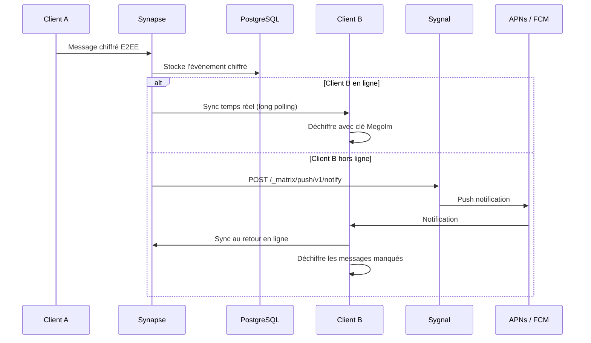

1. Le Client A envoie un message chiffré E2EE à Synapse via l'API Matrix
2. Synapse stocke l'événement chiffré dans PostgreSQL
3. Si le Client B est en ligne, Synapse le notifie via la synchronisation temps réel (long polling)
4. Si le Client B est hors ligne, Synapse envoie une notification push via Sygnal
5. Sygnal route vers APNs (iOS) ou Firebase (Android)
6. Le Client B reçoit la notification et synchronise les messages manqués au retour en ligne

### 2.4 Flux d'authentification

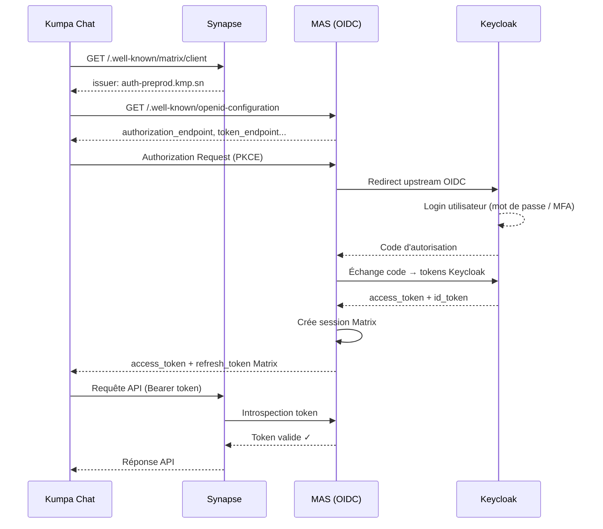

1. L'utilisateur ouvre Kumpa Chat
2. L'app découvre le homeserver via `.well-known/matrix/client`
3. Synapse retourne l'issuer MAS dans le well-known
4. L'app effectue la découverte OIDC auprès de MAS (`.well-known/openid-configuration`)
5. L'app redirige l'utilisateur vers MAS avec une demande d'autorisation (PKCE)
6. MAS redirige vers Keycloak (upstream OIDC)
7. L'utilisateur se connecte sur la page de login Keycloak
8. Keycloak retourne un code d'autorisation à MAS
9. MAS échange le code contre des tokens Keycloak
10. MAS crée une session Matrix et retourne les tokens (access + refresh) au client
11. Le client utilise l'access token pour accéder à l'API Synapse
12. Synapse valide chaque requête auprès de MAS (introspection du token)

### 2.5 Flux d'appel audio/vidéo

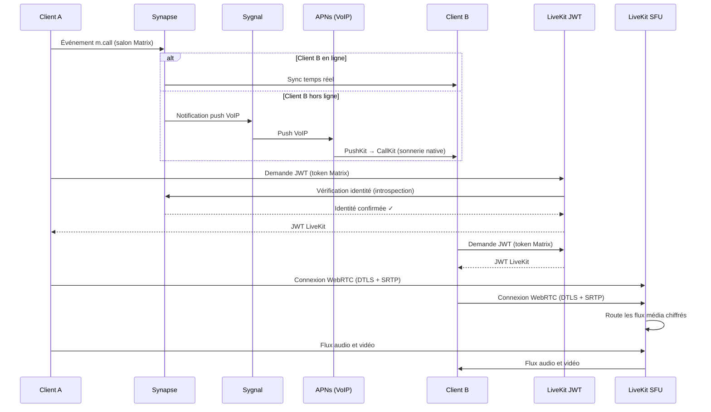

1. Le Client A crée un événement `m.call` dans le salon Matrix
2. Synapse notifie le Client B (sync en ligne ou push VoIP si hors ligne)
3. Si hors ligne : push VoIP via Sygnal → APNs → PushKit réveille l'app → CallKit affiche la sonnerie native
4. Le Client A demande un JWT à LiveKit JWT Service (avec son token Matrix)
5. LiveKit JWT vérifie l'identité du client auprès de Synapse (introspection)
6. LiveKit JWT émet un JWT LiveKit
7. Le Client B fait la même demande de JWT
8. Les deux clients se connectent à LiveKit SFU via WebRTC (DTLS + SRTP)
9. LiveKit route les flux média entre les participants sans les déchiffrer

---

## 3. Services et communication

### 3.1 Synapse — Homeserver Matrix

Le coeur du système. Synapse gère :
- La réception et le routage des messages entre utilisateurs
- Le stockage des événements Matrix (messages, réactions, fichiers) dans PostgreSQL
- La synchronisation des clients via l'API Matrix (`/_matrix/client/`)
- La fédération avec d'autres serveurs Matrix via le port 8448
- La délégation d'authentification à MAS (MSC3861)
- La notification de Sygnal quand un destinataire est hors ligne

**MSC supportées :**

| MSC | Description |
|-----|-------------|
| MSC3861 | Délégation d'authentification à MAS |
| MSC4143 | Découverte RTC Focus (LiveKit) |
| MSC3266 | Recherche d'utilisateurs |
| MSC4222 | Refresh tokens séparés |
| MSC4108 | Proxy auth |

**Well-known client :** Synapse expose un well-known qui indique aux clients où trouver les services :

```yaml
well_known_client_content:
  "m.homeserver":
    base_url: "https://preprod.kmp.sn"        # API Matrix
  "m.authentication":
    issuer: "https://auth-preprod.kmp.sn"      # MAS (OIDC)
  "org.matrix.msc4143.rtc_foci":               # LiveKit
    - type: "livekit"
      livekit_service_url: "https://call-preprod.kmp.sn/livekit"
  "io.element.call":
    widget_url: "https://call-preprod.kmp.sn"  # Element Call
```

### 3.2 MAS — Matrix Authentication Service

MAS est le fournisseur OIDC pour Synapse. Aucune authentification ne passe directement par Synapse — tout est délégué à MAS, qui lui-même délègue à Keycloak.

- Mot de passe local : **désactivé** (tout via Keycloak)
- Changement d'email : **interdit** (géré par Keycloak)
- Login par QR code : **activé**
- Login par code d'appareil : **activé**
- Branding : `Kumpa`

**Durées de vie des tokens :**

| Token | Durée |
|-------|-------|
| Code d'autorisation | 5 minutes |
| Access token | 1 heure |
| Refresh token | 24 heures |
| Device code | 10 minutes |

**Cycle de vie des tokens :**

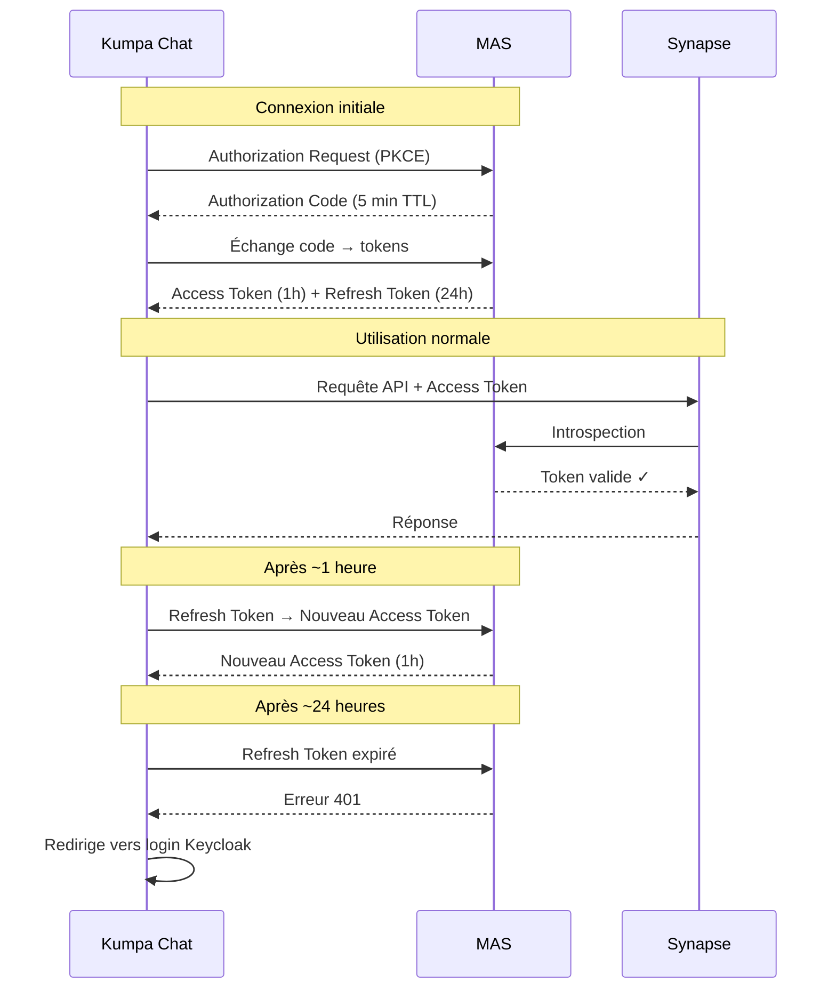

**Clients OIDC enregistrés :**

| Client | Type | Usage |
|--------|------|-------|
| Synapse | service | Communication serveur-à-serveur |
| Element X iOS | native | Application iOS Kumpa Chat |
| Element X Android | native | Application Android |
| Element Web | web | Client navigateur |

### 3.3 Sygnal — Push Gateway

Sygnal reçoit les notifications de Synapse et les route vers les bons services de push :
- **iOS** → Apple Push Notification service (APNs) via une clé P8
- **Android** → Firebase Cloud Messaging (FCM) via un service account JSON

Sygnal expose des métriques Prometheus sur le port 8001 pour le monitoring.

### 3.4 LiveKit — Serveur d'appels

LiveKit est un SFU (Selective Forwarding Unit) qui route les flux audio/vidéo WebRTC entre participants sans les décoder. Il intègre un serveur TURN pour traverser les firewalls/NAT.

### 3.5 LiveKit JWT Service

Service intermédiaire qui génère des tokens JWT pour autoriser les clients à se connecter à LiveKit. Il valide d'abord l'identité du client auprès de Synapse avant d'émettre le token.

### 3.6 Element Call

Interface web pour les appels vidéo. Utilisée directement dans le navigateur ou intégrée comme widget WebView dans les applications mobiles.

### 3.7 Synapse Admin

Interface web d'administration. Avec MAS activé, la connexion par login/mot de passe ne fonctionne pas — il faut se connecter avec un **token admin** injecté directement dans PostgreSQL.

### 3.8 Communication inter-services

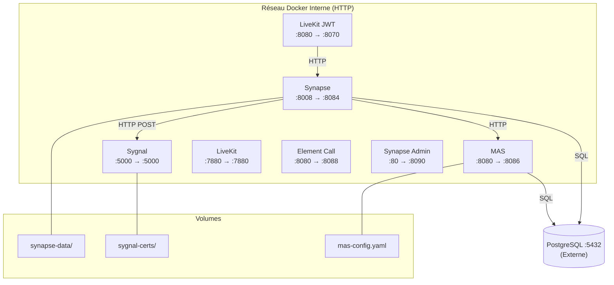

Les services communiquent entre eux via le réseau Docker interne. Les ports internes (conteneurs) diffèrent des ports exposés sur l'hôte :

| Service | Port interne (conteneur) | Port exposé (hôte) |
|---------|--------------------------|---------------------|
| Synapse | 8008 | 127.0.0.1:8084 |
| MAS | 8080 | 127.0.0.1:8086 |
| Sygnal | 5000 | 127.0.0.1:5000 |
| LiveKit | 7880 | 127.0.0.1:7880 |
| LiveKit JWT | 8080 | 127.0.0.1:8070 |
| Element Call | 8080 | 127.0.0.1:8088 |
| Synapse Admin | 80 | 127.0.0.1:8090 |
| PostgreSQL | 5432 | Externe |

Les communications internes :
- Synapse → MAS : validation des tokens (HTTP)
- Synapse → Sygnal : envoi des notifications push (HTTP POST)
- Synapse → PostgreSQL : stockage des données (SQL)
- MAS → PostgreSQL : stockage des sessions et tokens (SQL)
- MAS → Keycloak : authentification upstream (OIDC/HTTPS)
- LiveKit JWT → Synapse : vérification des tokens Matrix (HTTP)
- Sygnal → APNs : envoi des push iOS (HTTPS)
- Sygnal → Firebase : envoi des push Android (HTTPS)

---

## 4. Authentification

### 4.1 Chaîne d'authentification

La chaîne d'authentification repose sur trois composants :

**Keycloak** (Identity Provider) → **MAS** (OIDC Provider Matrix) → **Synapse** (Homeserver)

Synapse ne gère plus l'authentification directement (MSC3861). Toute requête API contenant un token est validée auprès de MAS via introspection OIDC. Cela signifie :
- Les mots de passe Matrix n'existent plus
- L'inscription passe obligatoirement par Keycloak
- La gestion des sessions est centralisée dans MAS

### 4.2 Keycloak — Identity Provider

Keycloak est le fournisseur d'identité (IdP). Il gère :
- Les comptes utilisateurs
- L'authentification (mot de passe, MFA, SSO)
- Les rôles (`admin`, `matrix_admin`, `super_admin`)
- Les claims OIDC

**Mapping des claims vers Matrix :**

| Claim Keycloak | Champ Matrix | Description |
|----------------|-------------|-------------|
| `preferred_username` | localpart (@user:server) | Identifiant Matrix |
| `name` | displayname | Nom affiché |
| `email` | email | Vérification forcée |
| `roles` | admin status | Détection automatique des admins |

### 4.3 Flux d'inscription d'un nouvel utilisateur

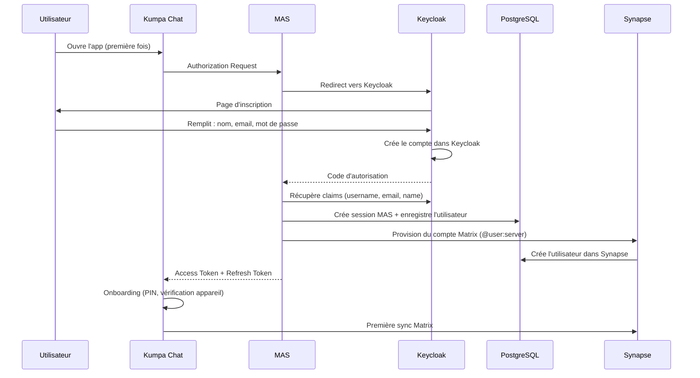

### 4.4 Configuration OIDC dans l'app iOS

L'app iOS utilise le flux OIDC avec PKCE (Proof Key for Code Exchange) pour l'authentification. Lors du login, l'utilisateur est redirigé vers un WebView affichant la page Keycloak. Un CSS personnalisé est injecté dans le WebView pour appliquer le thème vert Kumpa (#39785A) aux boutons, radio buttons, checkboxes et séparateurs de la page Keycloak.

---

## 5. Chiffrement et sécurité des données

### 5.1 Couches de chiffrement

Le système utilise quatre couches de chiffrement indépendantes :

**1. Transport (TLS 1.2+)**
- Nginx termine le TLS entre les clients et le serveur
- Tous les services internes communiquent en HTTP simple (réseau Docker isolé)

**2. Bout en bout — E2EE (Olm / Megolm)**
- Les messages sont chiffrés côté client avant d'être envoyés à Synapse
- Synapse stocke les messages chiffrés sans pouvoir les lire
- Seuls les participants disposant des clés peuvent déchiffrer

**3. Stockage (Keychain iOS / AES-256)**
- Les clés de chiffrement et tokens sont stockés dans le Keychain iOS
- Le Keychain utilise le Secure Enclave (puce matérielle)

**4. Authentification (JWT / OIDC)**
- Les tokens JWT sont signés avec une clé RSA (MAS)
- Les tokens OIDC proviennent de Keycloak

### 5.2 Chiffrement de bout en bout (E2EE)

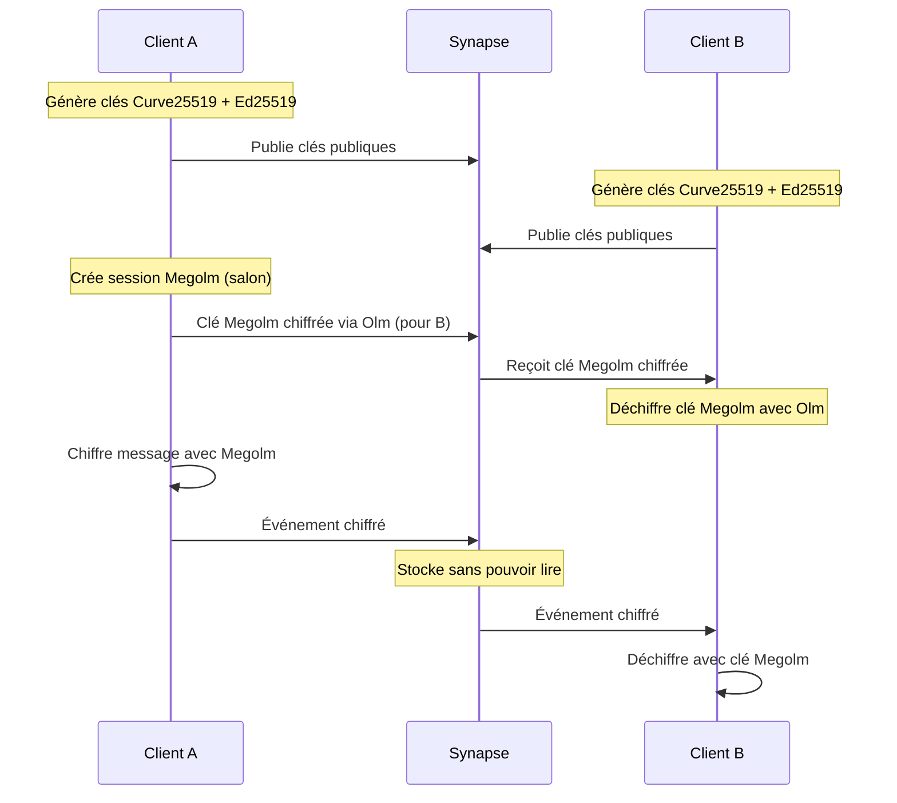

Le chiffrement E2EE garantit que **seuls les participants d'une conversation peuvent lire les messages**. Le serveur Synapse stocke les messages chiffrés mais ne peut pas les déchiffrer.

**Protocoles utilisés :**

| Protocole | Usage | Algorithme |
|-----------|-------|------------|
| **Olm** | Sessions 1-à-1 | Double Ratchet (X3DH + AES-256-CBC + HMAC-SHA-256) |
| **Megolm** | Sessions de groupe (salons) | AES-256-CBC + HMAC-SHA-256 avec ratchet avant |
| **SAS** | Vérification d'appareil | HMAC pour emoji de vérification |

**Fonctionnement :**

1. Chaque appareil génère une paire de clés Curve25519 (identité) et une paire Ed25519 (signature)
2. Les clés publiques sont publiées sur Synapse (les clés privées restent sur l'appareil)
3. Pour envoyer un message dans un salon, le client crée une session Megolm
4. La clé Megolm est partagée avec chaque appareil via des sessions Olm individuelles
5. Le message est chiffré avec Megolm et envoyé à Synapse
6. Les destinataires déchiffrent avec leur copie de la clé Megolm

**Chaîne de confiance des clés :**

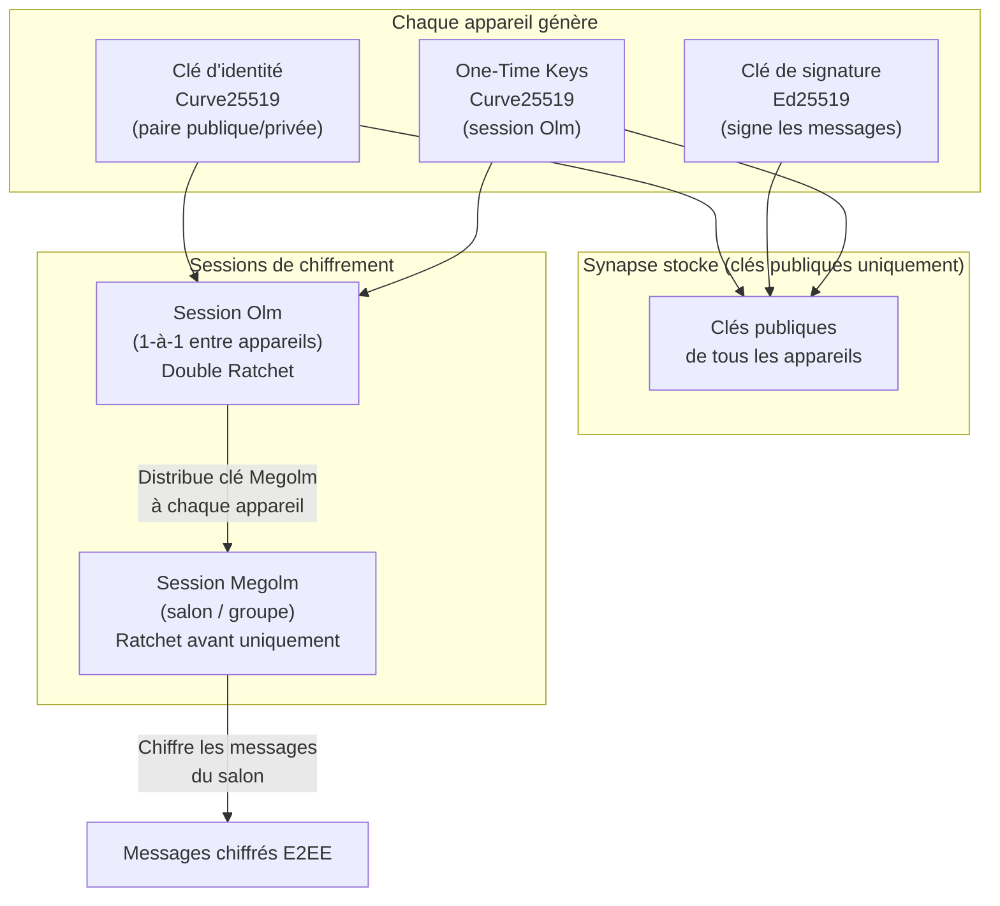

**Implémentation :** Toute la cryptographie est gérée par **MatrixRustSDK v25.07.15** (bindings Rust → Swift via FFI).

### 5.3 Stockage sécurisé sur iOS

| Donnée | Méthode de stockage | Protection |
|--------|---------------------|------------|
| Clés de chiffrement E2EE | Keychain iOS | AES-256, protégé par Secure Enclave |
| Tokens d'authentification | Keychain iOS | AES-256 |
| Base de données locale | Fichiers app sandbox | Chiffrement disque iOS (Data Protection) |
| Clés partagées App ↔ NSE | App Group | Keychain partagé |

Le **Keychain** iOS utilise le Secure Enclave (puce matérielle) pour protéger les clés. Même un accès root au système de fichiers ne permet pas de lire les données du Keychain sans la biométrie ou le code PIN de l'utilisateur.

### 5.4 Sauvegarde et récupération des clés

L'utilisateur peut sauvegarder ses clés E2EE sur le serveur via un **backup chiffré** :
- Les clés sont chiffrées côté client avec une clé de récupération
- Le serveur stocke le backup chiffré (illisible côté serveur)
- Lors de la connexion d'un nouvel appareil, l'utilisateur peut restaurer ses clés avec sa clé de récupération ou via la vérification croisée d'appareils

### 5.5 Vérification d'appareils

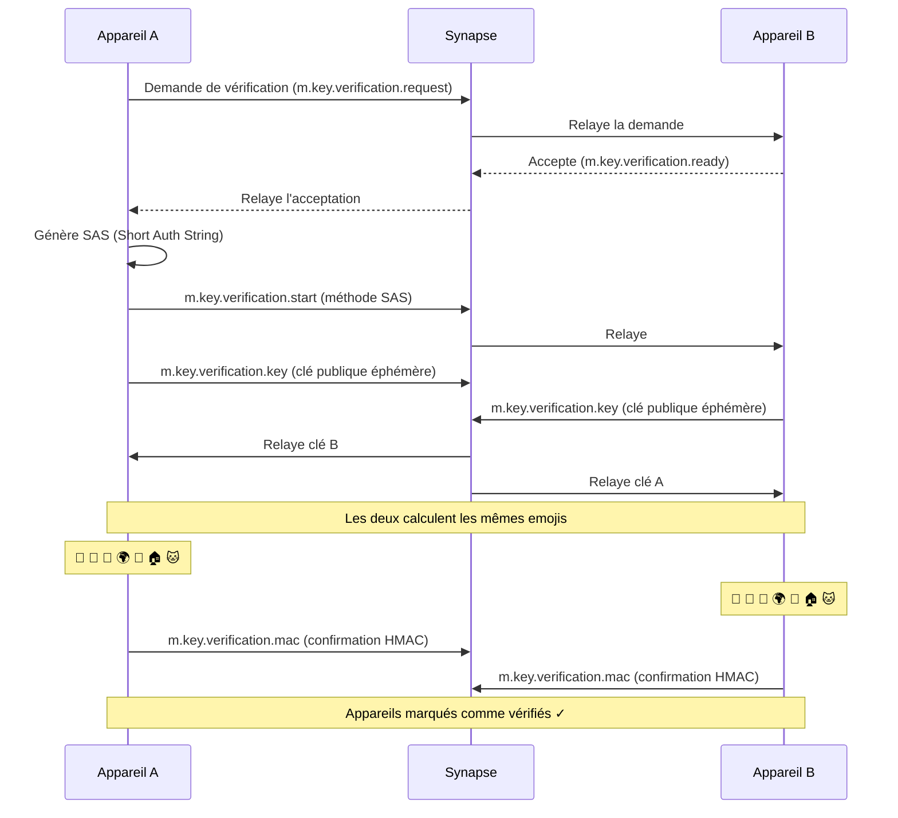

Pour confirmer qu'un interlocuteur est bien celui qu'il prétend être, Matrix utilise la **vérification croisée** :
1. Les deux utilisateurs lancent la vérification
2. Un ensemble d'emojis est affiché sur les deux appareils
3. Les utilisateurs comparent visuellement
4. Si les emojis correspondent, les appareils sont marqués comme vérifiés

### 5.6 Chiffrement des appels

Les flux audio/vidéo passent par LiveKit en WebRTC :
- **DTLS** (Datagram TLS) pour l'échange de clés
- **SRTP** (Secure Real-time Transport Protocol) pour chiffrer les flux média
- Le SFU LiveKit route les paquets chiffrés sans les déchiffrer

### 5.7 Gestion des secrets serveur

| Secret | Format | Usage |
|--------|--------|-------|
| Secrets Synapse (registration, macaroon, form) | Base64 24 octets | Signatures internes Synapse |
| Clé secrète MAS | 64 caractères hexadécimaux | Chiffrement des sessions MAS |
| Clé de chiffrement MAS | 64 caractères hexadécimaux | Chiffrement des données MAS |
| Secret LiveKit | Base64 32 octets | Authentification API LiveKit |
| Clé JWT MAS | RSA private key (PEM) | Signature des tokens JWT |
| Clé de signature Synapse | Ed25519 | Signature des événements Matrix (fédération) |
| Clé APNs P8 | Clé privée Apple (ECDSA P-256) | Authentification auprès d'APNs |
| Firebase service account | JSON (clé privée RSA) | Authentification auprès de FCM |

---

## 6. Application iOS

### 6.1 Informations générales

Kumpa Chat iOS est un **fork d'Element X iOS**, l'application Matrix officielle d'Element. L'application utilise l'architecture **MVVM-Coordinator** avec SwiftUI.

- **Langage :** Swift 5.0
- **iOS minimum :** 17.6
- **Architecture :** MVVM-Coordinator
- **UI Framework :** SwiftUI
- **Fichiers modifiés :** 56 (49 écrans + 7 composants Kumpa)

**Architecture MVVM-Coordinator :**

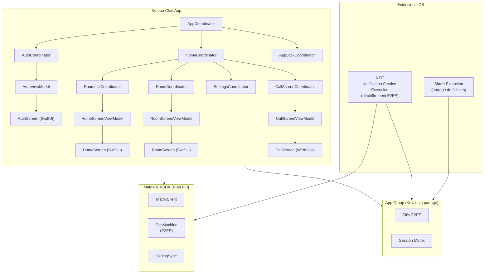

### 6.2 Dépendances et versions

| Dépendance | Version | Rôle |
|------------|---------|------|
| MatrixRustSDK | 25.07.15 | SDK Matrix via Rust FFI (crypto, sync, API) |
| EmbeddedElementCall | 0.13.1 | Appels WebRTC intégrés (widget WebView) |
| WysiwygComposer | 2.37.12 | Éditeur rich text pour messages |
| Sentry | 8.52.1+ | Crash reporting |
| PostHog | 3.27.0+ | Analytics |
| Kingfisher | 8.3.2+ | Chargement et cache d'images |
| KeychainAccess | 4.2.2+ | Stockage sécurisé (tokens, clés) |
| MapLibre | 5.13.0+ | Partage de localisation |
| SwiftOGG | 0.0.3+ | Messages vocaux |
| DTCoreText | 1.6.26 | Rendu HTML dans les messages |
| DSWaveformImage | 14.1.1 | Forme d'onde des messages vocaux |
| DeviceKit | 5.6.0+ | Détection du modèle d'appareil |
| SwiftState | 6.0.0+ | Machine d'état (flux d'appel) |
| GZIP | 1.3.2+ | Compression des données |
| Compound iOS | latest | Design system Element |
| swift-collections | 1.2.0+ | Structures de données Apple |
| swift-algorithms | 1.2.1+ | Algorithmes Apple |
| swift-async-algorithms | 1.0.0+ | Algorithmes asynchrones Apple |

### 6.3 Thème visuel Kumpa

**Couleurs :** Palette personnalisée définie dans `ElementX/Kumpa/Color+Extension.swift`

| Couleur | Usage |
|---------|-------|
| `buttonColor` | Vert Kumpa — couleur principale (boutons, accents, onglets actifs) |
| `chatBackgroundColor` | Fond des conversations |
| `chatBubleColor` | Couleur des bulles de message |
| `composerBgColor` | Fond du champ de saisie de message |
| `searchBarBg` | Fond de la barre de recherche |
| `gradient1`, `gradient2` | Dégradés (écran de verrouillage, splash) |
| `textColor`, `textColorGray`, `textColorWhite`, `textColorBlack` | Textes |
| `tabTextColor`, `tabTintColor` | Barre d'onglets |
| `filterBackgroundColor` | Fond des filtres |

**Polices :** Inter (Regular, Light, Medium, Bold) en remplacement de la police système, définies dans `ElementX/Kumpa/Font/Font+extension.swift`

| Police | Tailles disponibles |
|--------|---------------------|
| Inter Regular | 8, 10, 12, 16 |
| Inter Light | 12, 14 |
| Inter Bold | 10, 16, 18 |
| Inter Medium | 10 |

**Assets personnalisés** (dans `Resources/Assets.xcassets/Kumpa/`) :
- `logo` — Logo Kumpa
- `background` — Image de fond (écran d'authentification)
- `mobile` — Illustration appareil (vérification)
- `chat`, `chatIcon` — Icône discussions
- `settingsIcon` — Icône paramètres
- `audioCall`, `videoCall` — Icônes d'appel
- `send` — Icône envoi de message
- `attachment` — Icône pièce jointe
- `glass` — Icône recherche
- `plusIcon`, `moreIcon`, `inviteIcon`, `infoIcon` — Icônes d'action

### 6.4 Écrans personnalisés

#### Splash Screen (écran de démarrage)

**Fichier :** `ElementX/Kumpa/KumpaLaunchScreen.swift`

Écran affiché au lancement de l'application :
- Logo Kumpa centré
- Texte "République du Sénégal" (police Inter Regular 16)
- Sous-titre "La plateforme nationale d'échanges sécurisés" (police Inter Light 12)

Cet écran est également utilisé comme placeholder dans la vue split (iPad) via `PlaceholderScreenCoordinator.swift`.

#### Écran d'authentification (Login)

**Fichier :** `ElementX/Kumpa/AuthScreen.swift`

Écran de bienvenue avant la redirection vers Keycloak :
- Image de fond avec effets de dégradé
- Logo Kumpa (60x60)
- Message de bienvenue : "Bienvenue sur votre plateforme d'échanges sécurisés."
- Bouton de connexion vert (CustomButton)
- Card blanche avec coins arrondis

Le flux OIDC (page Keycloak) est affiché dans un WebView avec injection CSS pour appliquer le thème vert Kumpa (#39785A) aux boutons, radio buttons et checkboxes.

#### Onboarding — Suggestion PIN

**Fichier :** `Screens/Onboarding/AppLockSuggestionScreen/`

Nouvel écran créé pour Kumpa, affiché après la première connexion :
- Propose à l'utilisateur d'activer le code PIN pour sécuriser l'accès à l'application
- Deux actions : "Activer le PIN" ou "Ignorer"
- Architecture complète : Coordinator, ViewModel, Models, View

#### Onboarding — Vérification d'appareil

**Fichier :** `ElementX/Kumpa/DeviceConfirmation.swift`

Écran de vérification de session pendant l'onboarding :
- Texte : "Ouvrez Kumpa sur votre autre appareil"
- Instructions pour vérifier la session
- Illustration d'appareil mobile
- Bouton "Ignorer" avec thème vert

#### Écran de verrouillage (PIN)

**Fichier :** `Screens/AppLock/AppLockScreen/View/AppLockScreen.swift`

Interface complètement redessinée pour Kumpa :
- Fond avec dégradé vert (buttonColor avec opacité 0.05)
- En-tête repositionné avec logo
- Points de saisie PIN avec espacement augmenté (60pt en haut, 40pt entre)
- Clavier numérique personnalisé (AppLockScreenPINKeypad.swift)
- Bouton "PIN oublié" en bas avec texte vert
- Support VoiceOver pour accessibilité

#### Configuration PIN

**Fichier :** `Screens/AppLock/AppLockSetupPINScreen/`

Écran de configuration initiale du code PIN (4 ou 6 chiffres).

#### Configuration biométrie

**Fichier :** `Screens/AppLock/AppLockSetupBiometricsScreen/`

Écran de configuration Face ID / Touch ID après la création du PIN.

#### Liste des discussions (Home Screen)

**Fichier :** `Screens/HomeScreen/View/HomeScreen.swift`

Écran principal redessiné avec une barre d'onglets personnalisée à trois sections :

| Onglet | Icône | Action |
|--------|-------|--------|
| **Discussions** | `chatIcon` | Affiche la liste des conversations |
| **Inviter** | `inviteIcon` | Ouvre l'écran de démarrage de conversation |
| **Paramètres** | `settingsIcon` | Ouvre les paramètres |

- Badge de messages non lus sur l'onglet Discussions
- Couleur verte (buttonColor) pour l'onglet actif
- Filtres de liste avec thème Kumpa (RoomListFilterView.swift)
- Cellules de conversation personnalisées (HomeScreenRoomCell.swift)

#### Conversation (Chat / Room Screen)

**Fichier :** `Screens/RoomScreen/View/RoomScreen.swift`

Vue de conversation avec :
- Bulles de message avec couleur personnalisée (`chatBubleColor`) via `TimelineItemBubbledStylerView.swift`
- Barre de saisie personnalisée (ComposerToolbar) avec couleurs Kumpa
- Bouton d'envoi personnalisé
- Picker de pièces jointes (RoomAttachmentPicker.swift)
- Bouton d'enregistrement vocal (VoiceMessageRecordingButton.swift)
- Sondages avec zones de clic corrigées (PollView.swift, PollOptionView.swift)

#### Barre de recherche

**Fichier :** `ElementX/Kumpa/CustomTextField.swift` (contient CustomSearchBar)

Barre de recherche thémée utilisée dans toute l'application :
- Icône loupe verte (`glass`)
- Placeholder "Rechercher"
- Fond : `searchBarBg`
- Accent : `buttonColor`

#### Profil utilisateur

**Fichier :** `Screens/UserProfileScreen/View/UserProfileScreen.swift`

Modifications par rapport à Element X :
- Bouton **Appel Audio** ajouté (en plus de l'appel vidéo)
- Bouton de partage de lien **supprimé** (raison : sécurité/confidentialité)
- Espacement des boutons augmenté (16pt au lieu de 8pt)
- Génération de permalinks utilisateur désactivée

#### Paramètres

**Fichier :** `Screens/Settings/SettingsScreen/View/SettingsScreen.swift`

Écran de paramètres redessiné :
- Lignes de navigation personnalisées (`kumpaNavigationRow`)
- Section utilisateur avec avatar et style personnalisé
- Chevron vert pour la navigation
- Section "Gérer le compte" personnalisée
- Toggles de sécurité avec style personnalisé

Sous-écrans de paramètres modifiés :
- Paramètres avancés (AdvancedSettingsScreen)
- Paramètres de notifications (NotificationSettingsScreen)
- Paramètres analytics (AnalyticsSettingsScreen)
- Options développeur (DeveloperOptionsScreen)

#### Sécurité et confidentialité

**Fichier :** `Screens/SecurityAndPrivacyScreen/View/SecurityAndPrivacyScreen.swift`

- Toggles personnalisés (`customToggleRow`)
- Visibilité dans l'annuaire
- Toggle de chiffrement avec couleurs Kumpa

#### Création de salon

**Fichier :** `Screens/CreateRoom/View/CreateRoomScreen.swift`

Interface de création de salon avec thème Kumpa.

#### Invitation d'utilisateurs

**Fichier :** `Screens/InviteUsersScreen/View/InviteUsersScreen.swift`

Écran d'invitation avec :
- Sélection d'utilisateurs (InviteUsersScreenSelectedItem.swift)
- Couleurs Kumpa

#### Détails de salon

**Fichier :** `Screens/RoomDetailsScreen/View/RoomDetailsScreen.swift`

Informations du salon avec style Kumpa.

#### Rapport de bug

**Fichier :** `Screens/BugReportScreen/View/BugReportScreen.swift`

- Toggles personnalisés pour "Envoyer les logs" et "Peut me contacter"
- Style Kumpa

#### Écran d'appel

**Fichier :** `Screens/CallScreen/`

Modifications majeures du flux d'appel :
- Suivi de l'activation audio CallKit (`callKitAudioActivated`)
- WebRTC démarre uniquement après l'activation audio CallKit
- Nouveaux états : `prepareCall`, `startCall`
- Support async/await pour `stop()`
- Débogage VoIP via UserDefaults

### 6.5 Configuration Apple Developer

Pour que l'application fonctionne, configurer sur [Apple Developer Portal](https://developer.apple.com) :

**App IDs à créer :**
- App ID principal pour l'application
- App ID pour le Notification Service Extension (NSE) — suffixe `.NSE`
- App ID pour le Share Extension — suffixe `.ShareExtension`

**Capabilities à activer sur chaque App ID :**
- Push Notifications
- App Groups (même groupe partagé entre l'app et les extensions)
- Associated Domains (pour le login OIDC et les liens universels)

**Pour le NSE :**
- Activer Push Notifications sur l'App ID du NSE
- Le NSE doit être dans le même App Group que l'app principale pour accéder aux clés de chiffrement E2EE

**Clé APNs :**
- Créer une clé APNs (type P8) dans la section Keys du portail Apple
- Cette clé est universelle : elle fonctionne pour tous les App IDs du même compte
- Télécharger le fichier `.p8` et le placer dans `sygnal-certs/` sur le serveur
- Noter le Key ID et le Team ID pour la configuration Sygnal

**Provisioning Profiles :**
- Profil Development (Xcode automatique) et Distribution (App Store / Ad Hoc) pour chaque App ID

**Associated Domains :**
- Configurer les domaines pour l'authentification OIDC (redirection après login)
- Configurer les domaines pour Element Call (liens d'appel)
- Le fichier `apple-app-site-association` doit être servi par le serveur web sur chaque domaine

### 6.6 Notification Service Extension (NSE)

Le NSE est une extension iOS qui intercepte les push notifications **avant** qu'elles soient affichées à l'utilisateur. Son rôle principal est de **déchiffrer les messages E2EE**.

**Fonctionnement :**

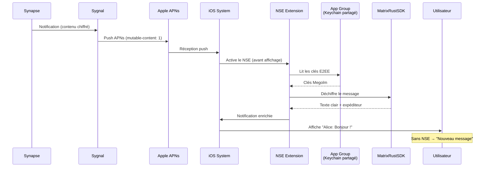

1. Synapse envoie une notification à Sygnal (contenu chiffré)
2. Sygnal envoie un push APNs avec `mutable-content: 1`
3. iOS active le NSE avant d'afficher la notification
4. Le NSE lit les clés E2EE via l'App Group partagé
5. Le NSE déchiffre le message avec MatrixRustSDK
6. La notification enrichie est affichée (nom expéditeur, texte déchiffré)

Sans le NSE, l'utilisateur verrait uniquement "Nouveau message" au lieu du contenu réel.

### 6.7 Fonctionnalités

**Messagerie :**
- Chiffrement de bout en bout (E2EE)
- Threads de discussion
- Édition et suppression de messages
- Réactions (emoji)
- Éditeur rich text (WYSIWYG)
- Partage de fichiers et médias
- Mentions (@user)
- Indicateurs de frappe et accusés de lecture
- Messages vocaux
- Sondages
- Partage de localisation

**Appels :**
- Appels audio/vidéo via Element Call (widget WebView)
- Intégration CallKit (sonnerie native iOS)
- Push VoIP pour appels entrants (PushKit)
- Activation micro par défaut
- Désactivation CallKit en Chine (conformité MIIT)

**Sécurité :**
- Vérification croisée d'appareils
- Sauvegarde chiffrée des clés
- Verrouillage biométrique (Face ID / Touch ID)
- Code PIN
- Suggestion de PIN à l'onboarding

---

## 7. Notifications Push

### 7.1 Architecture des notifications

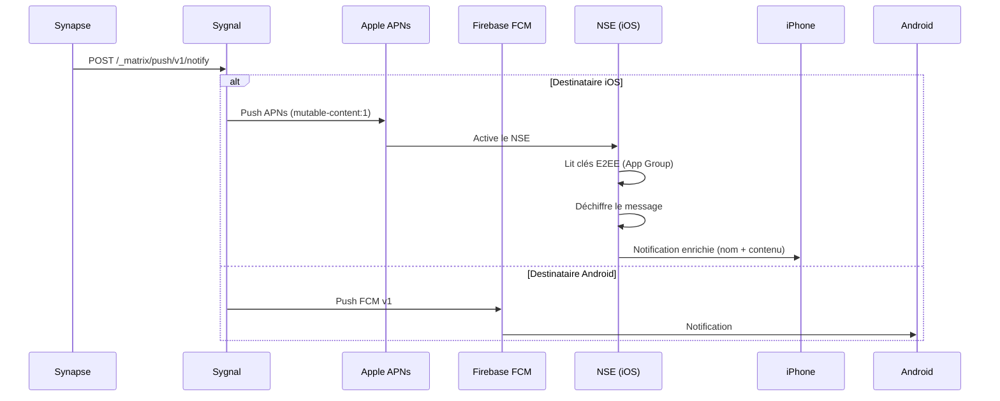

Le flux de notification push se déroule ainsi :

1. Un message arrive sur Synapse
2. Synapse détermine les destinataires hors ligne
3. Synapse envoie la notification à Sygnal via HTTP POST (`/_matrix/push/v1/notify`)
4. Sygnal identifie le type de push (APNs ou Firebase) et route vers le bon service
5. Le système d'exploitation du destinataire affiche la notification
6. (iOS) Le NSE déchiffre le contenu E2EE avant affichage

### 7.2 Types de push iOS

Il existe trois types de push distincts :

**1. Push standard (alert)** — Messages texte et médias
- Sygnal envoie un push APNs de type `alert`
- iOS active le NSE qui déchiffre le contenu E2EE
- La notification enrichie est affichée avec le nom de l'expéditeur et le contenu du message

**2. Push VoIP** — Appels uniquement
- Sygnal envoie un push APNs de type `voip`
- iOS active immédiatement PushKit, qui réveille l'app en arrière-plan
- L'app déclenche CallKit pour afficher l'écran d'appel natif avec sonnerie système
- Ce type de push a la plus haute priorité et réveille le téléphone même en mode silencieux

**3. Push NSE** — Déchiffrement en arrière-plan
- Push silencieux avec `mutable-content: 1`
- Le NSE s'active, lit les clés de chiffrement via l'App Group partagé
- Déchiffre le message et modifie la notification avant affichage

### 7.3 Configuration Sygnal

**Credentials APNs :**
- Clé P8 : `AuthKey_BQTVT7P6GD.p8`
- Key ID : `BQTVT7P6GD`
- Team ID : `5642JX7ZP9`
- Topic : `sn.niane.kumpa.chat`

Les pushkins sont configurés pour **sandbox** (builds Xcode) et **production** (TestFlight/App Store).

**Android :**
- Firebase Cloud Messaging v1 API
- Fichier de credentials : `kumpa-firebase-adminsdk.json`

### 7.4 Configuration côté Apple

Pour que les push fonctionnent :

1. **Créer une clé APNs P8** dans Apple Developer > Keys
2. **Activer Push Notifications** sur tous les App IDs (app + NSE)
3. **Placer le fichier .p8** dans `sygnal-certs/` sur le serveur
4. **Configurer Sygnal** avec le key_id, team_id et le topic correspondant
5. **Tester en sandbox** d'abord (builds Xcode), puis basculer en production (TestFlight/App Store)

### 7.5 Configuration côté Firebase (Android)

1. **Créer un projet Firebase** sur la console Firebase
2. **Générer un service account JSON** (Firebase Console > Paramètres > Comptes de service)
3. **Placer le fichier JSON** dans `sygnal-certs/kumpa-firebase-adminsdk.json`
4. **Configurer Sygnal** avec le project_id Firebase

---

## 8. Appels Audio/Vidéo

### 8.1 Stack technique

| Couche | Technologie | Rôle |
|--------|-------------|------|
| Signalisation | MatrixRTC (MSC4143) | Découverte de la salle d'appel via événements Matrix |
| Authentification | LiveKit JWT Service | Émission de tokens d'accès après validation Synapse |
| Média | LiveKit SFU | Routage des flux audio/vidéo (sans déchiffrement) |
| Transport | WebRTC (SRTP + DTLS) | Transmission chiffrée en temps réel |
| NAT Traversal | TURN (intégré à LiveKit) | Relais pour les clients derrière firewall/NAT |
| UI web | Element Call | Interface d'appel dans le navigateur |
| UI iOS | EmbeddedElementCall v0.13.1 | Widget WebView intégré dans l'app |
| Téléphonie iOS | CallKit + PushKit | Sonnerie native, intégration système |

### 8.2 Flux VoIP iOS (PushKit → CallKit)

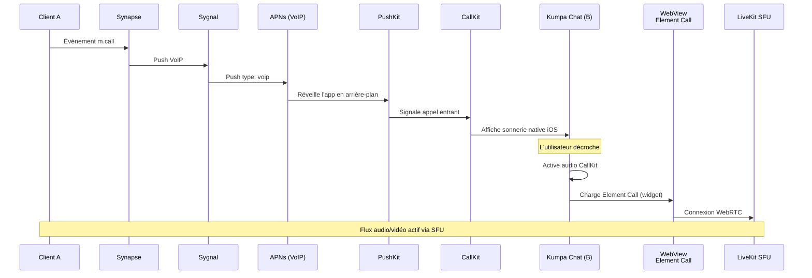

### 8.3 TURN — Traversée de NAT

Le serveur TURN est intégré à LiveKit et permet aux clients situés derrière un firewall ou un NAT symétrique de se connecter. Le flux média est relayé par le serveur TURN si une connexion directe (STUN) échoue.

- Domaine : IP publique du serveur
- Port UDP : 3478
- TLS externe : activé
- Le client tente d'abord une connexion directe, puis passe par TURN si nécessaire

---

## 9. Ports réseau et firewall

### 9.1 Ports internes (localhost uniquement)

Ces ports sont bindés sur `127.0.0.1` et accessibles uniquement depuis le serveur. L'accès externe passe par le reverse proxy Nginx.

| Port | Service | Protocole |
|------|---------|-----------|
| 5000 | Sygnal Push Gateway | HTTP |
| 7880 | LiveKit API | HTTP |
| 8001 | Sygnal Métriques Prometheus | HTTP |
| 8070 | LiveKit JWT Service | HTTP |
| 8084 | Synapse Client API | HTTP |
| 8086 | MAS (OIDC) | HTTP |
| 8088 | Element Call UI | HTTP |
| 8090 | Synapse Admin | HTTP |

### 9.2 Ports externes (à ouvrir dans le firewall)

Ces ports doivent être accessibles depuis Internet.

| Port | Protocole | Service | Pourquoi |
|------|-----------|---------|----------|
| 443 | TCP | Nginx | HTTPS (tous les services web) |
| 8448 | TCP | Synapse | Fédération Matrix (communication inter-serveurs) |
| 3478 | UDP + TCP | LiveKit TURN | Traversée NAT pour les appels |
| 7881 | TCP | LiveKit | WebRTC TCP fallback |
| 50100-50200 | UDP | LiveKit | Flux média WebRTC (audio/vidéo) |

---

## 10. Environnements

### 10.1 Trois environnements

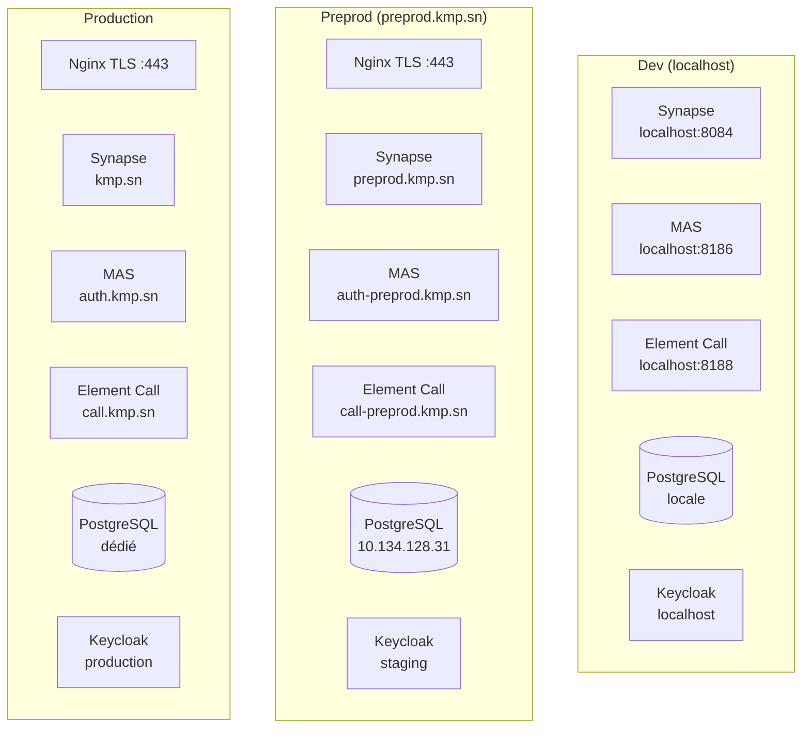

| Aspect | Dev | Preprod | Production |
|--------|-----|---------|------------|
| **Domaine Synapse** | `localhost` | `preprod.kmp.sn` | `kmp.sn` |
| **Domaine MAS** | `localhost:8186` | `auth-preprod.kmp.sn` | `auth.kmp.sn` |
| **Domaine Appels** | `localhost:8188` | `call-preprod.kmp.sn` | `call.kmp.sn` |
| **Keycloak** | localhost | staging | production |
| **Base de données** | Externe (locale) | Externe (`10.134.128.31`) | Externe (dédié) |
| **SSL** | HTTP | HTTPS (Nginx) | HTTPS (Nginx) |
| **LiveKit IP** | `127.0.0.1` | `160.0.131.183` | IP publique prod |

### 10.2 Variables d'environnement principales

Les fichiers `.env.dev`, `.env.preprod`, `.env.prod` contiennent les variables spécifiques à chaque environnement :

| Catégorie | Variables | Description |
|-----------|----------|-------------|
| Domaines | `SYNAPSE_SERVER_NAME`, `MAS_PUBLIC_BASEURL`, `ELEMENT_CALL_URL` | URLs publiques des services |
| Base de données | `POSTGRES_HOST`, `POSTGRES_DB`, `POSTGRES_USER` | Connexion PostgreSQL |
| Keycloak | `KEYCLOAK_ISSUER`, `KEYCLOAK_CLIENT_ID` | Connexion OIDC upstream |
| LiveKit | `LIVEKIT_NODE_IP`, `LIVEKIT_KEY`, `LIVEKIT_SECRET` | Configuration SFU |
| Secrets | Multiples clés et tokens | Authentification inter-services |

---

## 11. Reverse Proxy Nginx

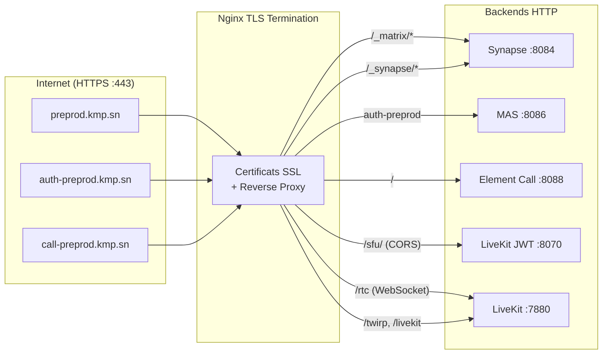

### 11.1 Routage Element Call

Le fichier `nginx-element-call.conf` configure le routage pour Element Call et LiveKit :

| Route | Backend | Usage |
|-------|---------|-------|
| `/` | localhost:8088 | Interface Element Call |
| `/sfu/` | localhost:8070 | LiveKit JWT Service (avec CORS) |
| `/rtc` | localhost:7880 | WebSocket LiveKit (upgrade HTTP→WS, timeout 7 jours) |
| `/twirp` | localhost:7880 | API gRPC LiveKit |
| `/livekit` | localhost:7880 | Proxy LiveKit |

### 11.2 Domaines à configurer

| Domaine | Service | Port backend |
|---------|---------|-------------|
| `preprod.kmp.sn` | Synapse | 8084 |
| `auth-preprod.kmp.sn` | MAS | 8086 |
| `call-preprod.kmp.sn` | Element Call + LiveKit JWT | 8088 + 8070 |

### 11.3 Points importants

- **WebSocket** : La route `/rtc` nécessite `proxy_http_version 1.1` et les headers `Upgrade` / `Connection` pour le handshake WebSocket. Le timeout est de 7 jours pour maintenir la connexion pendant les appels.
- **CORS** : La route `/sfu/` ajoute les headers CORS (`Access-Control-Allow-Origin: *`) car le LiveKit JWT Service est appelé depuis des origines différentes.
- **TLS** : Nginx gère les certificats SSL. Tous les services internes communiquent en HTTP simple.

---

## 12. Fichiers critiques et sauvegarde

### 12.1 Fichiers à sauvegarder impérativement

| Fichier | Importance | Conséquence si perdu |
|---------|-----------|----------------------|
| `synapse-data/*.signing.key` | **CRITIQUE** | Perte de fédération, impossible de récupérer l'identité du serveur |
| `.env` | **CRITIQUE** | Tous les secrets du déploiement |
| Base PostgreSQL | **CRITIQUE** | Perte de tous les messages, comptes et historique |
| `sygnal-certs/` | IMPORTANT | Plus de notifications push (recréer clé APNs + Firebase) |
| `mas-config.yaml` | IMPORTANT | Plus d'authentification (régénérable) |

### 12.2 Structure du projet

```
kumpa-chat-synapse/
├── .env                          # Variables d'environnement actives
├── .env.dev / .env.preprod / .env.prod
├── docker-compose.yml            # Définition des 8 services
├── homeserver.yaml.template      # Template config Synapse
├── livekit.yaml.template         # Template config LiveKit
├── element-config.json.template  # Template config Element Web
├── mas-config.yaml               # Configuration MAS (OIDC)
├── sygnal.yaml                   # Configuration push (APNs + Firebase)
├── nginx-element-call.conf       # Reverse proxy Element Call
├── deploy.sh                     # Script de déploiement
├── validate-env.sh               # Validation des variables
├── switch-env.sh                 # Changement d'environnement
├── create-admin.sh               # Création admin dans PostgreSQL
├── synapse-data/                 # Données Synapse (clé de signature, médias)
└── sygnal-certs/                 # Certificats push (P8 Apple, JSON Firebase)
```

---

## 13. Références

### Protocole Matrix
- [Spécification Matrix](https://spec.matrix.org/)
- [Synapse Documentation](https://matrix-org.github.io/synapse/latest/)

### Authentification
- [Matrix Authentication Service](https://github.com/element-hq/matrix-authentication-service)
- [MSC3861 - OIDC Authentication](https://github.com/matrix-org/matrix-spec-proposals/pull/3861)
- [Keycloak Documentation](https://www.keycloak.org/documentation)

### Chiffrement
- [Spécification Olm/Megolm](https://matrix.org/docs/matrix-concepts/end-to-end-encryption/)
- [MatrixRustSDK (crypto)](https://github.com/matrix-org/matrix-rust-sdk)

### Appels et Média
- [LiveKit Documentation](https://docs.livekit.io/)
- [Element Call](https://github.com/element-hq/element-call)
- [MSC4143 - RTC Focus Discovery](https://github.com/matrix-org/matrix-spec-proposals/pull/4143)

### Notifications
- [Sygnal Documentation](https://github.com/matrix-org/sygnal)
- [Apple Push Notification service](https://developer.apple.com/documentation/usernotifications)
- [Firebase Cloud Messaging](https://firebase.google.com/docs/cloud-messaging)

### Client iOS
- [Element X iOS](https://github.com/element-hq/element-x-ios)

---

> **Document mis à jour le 29 Janvier 2026**
